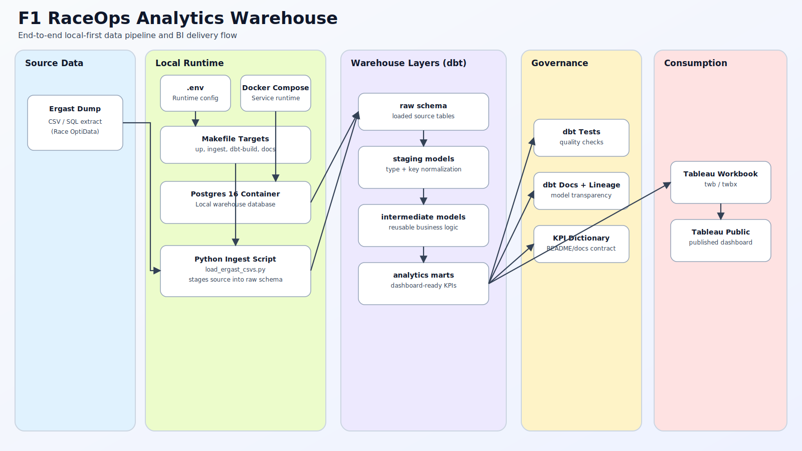

# F1 RaceOps Analytics Warehouse (Postgres + dbt + Tableau)

[](#roadmap)
[](https://www.python.org/)
[](https://www.postgresql.org/)
[](https://docs.getdbt.com/docs/core/connect-data-platform/postgres-setup)
[](https://docs.docker.com/compose/)
[](https://www.tableau.com/)
[](https://www.raceoptidata.com/ergast_dump.html)
[](https://github.com/aosman101/f1-raceops-analytics-warehouse/actions)
[](#testing-and-data-quality-plan)
[](#license)

Local-first Formula 1 analytics warehouse focused on RaceOps performance:
- Faster and more reliable pit stop analysis
- Strategy signal proxies
- Constructor and driver reliability insights
- Tableau-first storytelling layer for decision-ready views

> This README is a living document. It is intentionally detailed now and will be updated as implementation progresses.

## Contents
- [Project objectives](#project-objectives)
- [End-to-end architecture](#end-to-end-architecture)
- [Current repository status](#current-repository-status)
- [Tech stack](#tech-stack)
- [Data source and assumptions](#data-source-and-assumptions)
- [Planned warehouse model](#planned-warehouse-model)
- [Planned marts and KPI definitions](#planned-marts-and-kpi-definitions)
- [Tableau deliverables](#tableau-deliverables)
- [Local development setup](#local-development-setup)
- [Make targets](#make-targets)
- [Roadmap](#roadmap)
- [Testing and data quality plan](#testing-and-data-quality-plan)
- [Known gaps](#known-gaps)
- [License](#license)
- [Attribution](#attribution)

## Project Objectives
Build an end-to-end analytics project that demonstrates:
- Data engineering: controlled ingestion into Postgres raw schemas
- Analytics engineering: dbt layer design, tests, docs, and marts
- BI delivery: Tableau dashboards with consistent KPI logic and drill paths
- Reproducibility: local environment via Docker Compose + environment-managed config

Target outcomes:
- Reliable baseline F1 operational KPIs across seasons and constructors
- Reusable marts for analysis and dashboarding
- A portfolio-ready Tableau project with transparent metric definitions

## End-to-End Architecture


Architecture asset: `docs/images/end-to-end-architecture.svg`

## Current Repository Status
Implemented now:
- Bootstrap configuration and local infrastructure files
- Schema initialization SQL
- Makefile command surface
- Initial documentation framework
- End-to-end architecture diagram asset

Not yet implemented:
- Ingestion script logic
- dbt project folder and models
- Tableau workbook and published dashboard link
- CI workflow and automated validation

## Tech Stack
- Storage and compute: Postgres 16 (Docker container)
- Transformations: dbt Core (Postgres profile)
- Ingestion: Python (`psycopg2-binary`, `python-dotenv`)
- Orchestration (local): `make` targets
- Visualization: Tableau (primary BI tool)
- Source control: Git + GitHub

## Data Source and Assumptions
Primary dataset:
- Ergast-compatible F1 historical dataset: <https://www.raceoptidata.com/ergast_dump.html>

Assumptions:
- Data is ingested in local development from extracted files under `data/raw/`
- Raw layer preserves source grain and original values as much as possible
- Business-ready semantics are introduced in dbt staging/intermediate/marts layers

## Planned Warehouse Model
Layering strategy:
- `raw` schema
  - Direct loaded source tables
  - Minimal transformation
- `staging` models (dbt)
  - Type normalization, key casting, naming cleanup, null handling
- `intermediate` models (dbt)
  - Reusable joins and race/session-level derived logic
- `analytics` marts (dbt)
  - Dashboard-facing fact-like and dimension-like curated models

Design principles:
- Stable grains per model
- Explicit primary and foreign key relationships where applicable
- Deterministic KPI logic defined once in marts, consumed directly in Tableau

## Planned Marts and KPI Definitions
`mart_pitstop_performance`
- Grain: constructor x race (rollups to season)
- Core metrics:
  - `pit_time_median_sec`
  - `pit_time_p10_sec`
  - `pit_time_p90_sec`
  - `pit_stop_count`

`mart_reliability`
- Grain: constructor x season (with driver drilldowns)
- Core metrics:
  - `dnf_rate`
  - `mechanical_dnf_count`
  - `points_lost_proxy`

`mart_constructor_ops_season`
- Grain: constructor x season
- Core metrics:
  - `total_points`
  - `wins`
  - `podiums`
  - `avg_grid_position`
  - `avg_finish_position`

Notes:
- Exact KPI formulas may evolve after profiling source quality and edge cases.
- Metric definitions should be versioned in this README (or companion docs) as they stabilize.

## Tableau Deliverables
Planned Tableau outputs:
- Executive overview dashboard
  - Constructor ops summary by season
  - KPI scorecards and trend lines
- Pit stop analysis dashboard
  - Distribution bands, outlier races, team comparisons
- Reliability and strategy dashboard
  - DNF patterns, likely points impact, race context filters

Planned Tableau interactions:
- Season, constructor, driver filters
- Drill-down from season to race-level records
- Tooltip definitions that map directly to warehouse KPI logic

Publication target:
- Tableau Public link: `TBD`

## Local Development Setup
Prerequisites:
- Docker + Docker Compose
- Python 3.11+
- `make`

Environment setup:
```bash
cp .env.example .env
```

Start local Postgres:
```bash
make up
```

Verify schema bootstrap:
```bash
make psql
```

Inside `psql`, run:
```sql
\dn
```
Expected schemas include `raw` and `analytics`.

## Make Targets
Available commands:
- `make up`: start Postgres container
- `make down`: stop and remove running compose services
- `make logs`: stream Postgres logs
- `make psql`: open interactive `psql` in the container
- `make ingest`: planned CSV ingestion entry point
- `make dbt-deps`: install dbt packages (when dbt project exists)
- `make dbt-build`: run dbt models/tests/docs build flow
- `make dbt-test`: execute dbt tests
- `make dbt-docs`: generate and serve dbt docs locally

## Roadmap
- [x] Initialize repository docs and local config bootstrap
- [x] Add Docker Compose + schema initialization
- [x] Add environment templates and local Make targets
- [ ] Implement ingestion script (`ingest/load_ergast_csvs.py`)
- [ ] Add dbt project scaffold and profiles
- [ ] Build staging models and baseline tests
- [ ] Build marts for pit stop, reliability, and constructor ops KPIs
- [ ] Publish dbt docs + lineage
- [ ] Build Tableau workbook and publish Tableau Public dashboard
- [ ] Add CI checks for lint/tests/build workflow

## Testing and Data Quality Plan
Data quality checks (planned):
- Source-to-raw row count reconciliation
- Required key null checks
- Duplicate primary key checks at each modeled grain
- Relationship tests between core entities
- Metric sanity checks for distributions and outliers

Testing layers:
- Ingestion script validation (load counts and exceptions)
- dbt generic and singular tests
- Smoke checks before Tableau refresh

Current status:
- CI not configured
- Coverage not tracked
- Manual validation only

## Known Gaps
- No ingestion implementation committed yet
- No dbt project directory committed yet
- No Tableau workbook/dashboard link committed yet
- License file not added yet

## License
License is currently `TBD`. Until a license file is added, all rights are reserved by default.

## Attribution
- Dataset source: Ergast-compatible dump by Race OptiData
