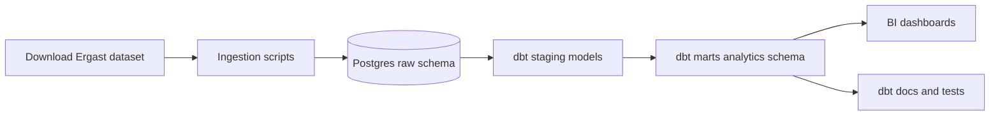

# F1 RaceOps Analytics Warehouse (Postgres + dbt)

[](#roadmap)
[](https://www.python.org/)
[](https://www.postgresql.org/)
[](https://docs.getdbt.com/docs/core/connect-data-platform/postgres-setup)
[](https://docs.docker.com/compose/)
[](https://www.raceoptidata.com/ergast_dump.html)
[](https://github.com/aosman101/f1-raceops-analytics-warehouse/actions)
[](#testing-and-coverage)
[](#license)

A local-first Formula 1 analytics warehouse focused on converting Ergast-compatible race data into operational RaceOps KPIs for pit stops, strategy, and reliability.

> Portfolio goal: show end-to-end data engineering + analytics engineering from ingestion to warehouse modeling, testing, docs, and BI delivery.

## Contents
- [Overview](#overview)
- [Planned architecture](#planned-architecture)
- [Current repository status](#current-repository-status)
- [Data source](#data-source)
- [Planned marts and KPIs](#planned-marts-and-kpis)
- [Planned commands](#planned-commands)
- [BI outputs](#bi-outputs)
- [Roadmap](#roadmap)
- [Testing and coverage](#testing-and-coverage)
- [License](#license)
- [Attribution](#attribution)

## Overview
The target stack is:
- Postgres 16 as the warehouse
- dbt Core for transformations and tests
- Docker Compose for local reproducibility
- Tableau Public and/or Power BI for final visualizations

## Planned Architecture


## Current Repository Status
- This branch currently contains project documentation only.
- Source code, dbt project files, and pipeline scripts are not yet committed here.
- The roadmap below reflects the planned implementation order.

## Data Source
- Ergast-compatible F1 historical dataset: <https://www.raceoptidata.com/ergast_dump.html>

## Planned Marts and KPIs
- `mart_pitstop_performance`
  - Median, p10, p90 pit stop times by constructor and season
- `mart_reliability`
  - DNF rate and points-lost proxy by constructor and driver
- `mart_constructor_ops_season`
  - Season-level points, wins, podiums, and ops metrics

## Planned Commands
These are the intended local workflow commands once the scaffold is added:

```bash
docker compose up -d
dbt deps
dbt seed
dbt run
dbt test
dbt docs generate && dbt docs serve
```

## BI Outputs
- Tableau Public dashboard link: `TBD`
- Power BI report/screenshots: `TBD`

## Roadmap
- [x] Define project scope and architecture
- [ ] Add ingestion layer for Ergast-compatible data
- [ ] Add Postgres raw schema and load process
- [ ] Build dbt staging models
- [ ] Build dbt marts and tests
- [ ] Publish dbt docs
- [ ] Publish BI dashboard and screenshots

## Testing and Coverage
- Automated test workflow is not configured yet.
- Code coverage is not tracked yet.

## License
No license file has been added yet. Until a license is published, all rights are reserved by default.

## Attribution
- Dataset source: Ergast-compatible dump by Race OptiData.
