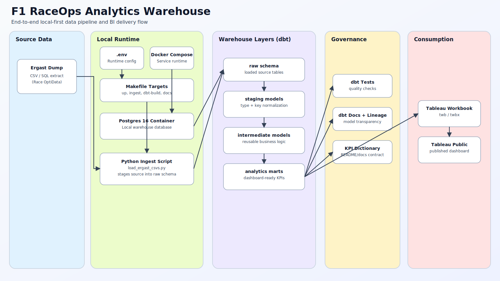

# F1 RaceOps Analytics Warehouse

A local-first analytics warehouse for Formula 1, built using Postgres, Python for data ingestion, dbt for transformation, and ready for Tableau marts.

## Project Status
The core pipeline has been implemented with the following components: 
- A local PostgreSQL environment using Docker Compose.
- Ergast data ingestion through CSV and SQL dump loaders.
- dbt staging along with core dimensions, facts, and RaceOps marts.
- Basic CI for dbt parse upon push or pull request.

Still open:
- Expanded dbt test coverage and KPI documentation.
- Published Tableau dashboard link.
- MIT license file.

## Architecture


Flow: Ergast source files -> `raw` schema -> dbt `staging` + `analytics` models -> Tableau dashboards.

## Tech Stack
- Postgres 16
- Python 3.11+ (`psycopg2-binary`, `python-dotenv`)
- dbt Core (`dbt-postgres`)
- Docker Compose
- Tableau

## Repository Layout
- `ingest/`: CSV and SQL-dump loaders
- `sql/init/`: schema bootstrap SQL (`raw`, `analytics`)
- `dbt/`: dbt project (staging, core, raceops marts, macros)
- `dashboards/tableau/`: Tableau workbook artefacts
- `docs/`: architecture and KPI notes

## Quickstart

### 1) Prerequisites
- Docker + Docker Compose
- Python 3.11+
- `make`
- dbt Core + `dbt-postgres` available in your environment

### 2) Configure environment
```bash
cp .env.example .env
```

### 3) Start Postgres
```bash
make up
```

### 4) Load source data
CSV path (default in Makefile):
```bash
make ingest
```
This expects extracted CSV files under `data/raw/ergast_2024`.

SQL dump alternative:
```bash
bash ingest/load_sql_dump.sh path/to/ergast_dump.sql
```

### 5) Build analytics models
```bash
make dbt-deps
make dbt-build
make dbt-test
```

### 6) Optional: serve dbt docs
```bash
make dbt-docs
```

## Warehouse Model Overview

### Staging (`schema: staging`, materialised as views)
Standardises Ergast source tables:
`circuits`, `constructors`, `drivers`, `races`, `results`, `pit_stops`, `lap_times`, `qualifying`, `status`.

### Core (`schema: analytics`, materialised as tables)
Dimensions:
- `dim_driver`
- `dim_constructor`
- `dim_circuit`
- `dim_race`
- `dim_status`

Facts:
- `fct_race_results`
- `fct_pit_stops`
- `fct_lap_times`
- `fct_qualifying`

### RaceOps Marts (`schema: analytics`, materialised as tables)
- `mart_pitstop_performance`: pit stop distribution metrics by season and constructor.
- `mart_reliability`: DNF rate and points-lost estimate by season and constructor.
- `mart_constructor_ops_season`: season-level constructor performance summary.
- `mart_driver_ops_season`: season-level driver performance summary.

## CI and Data Quality
- GitHub Actions runs `dbt parse` on pushes to `main` and pull requests.
- dbt tests are executable via `make dbt-test`.
- Comprehensive schema/relationship tests are not fully defined yet.

## Tableau
Store Tableau files in `dashboards/tableau/` (for example `f1-raceops-analytics.twbx`).
The public dashboard link has not been published yet.

## Attribution
- Data source: Ergast-compatible dataset from Race OptiData: https://www.raceoptidata.com/ergast_dump.html
